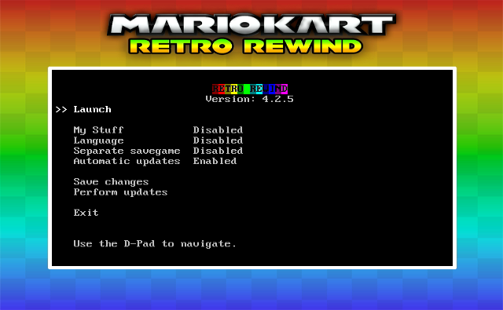

# Retro Rewind Launcher

This is an experimental channel for Wii, Wii U and Dolphin to launch and manage the Retro Rewind Mario Kart Wii distribution. \
The channel aims to provide three main features:

- Stable and performant patching and loading of Retro Rewind.
- Functionality to update Retro Rewind, and (optionally) automatically check for updates.
- Provide basic configuration including language and "My Stuff" (for custom assets).

The channel makes use of a simple text-based interface enclosed in a decorative banner. 
This is a stylistic choice intended to keep the dependency stack lightweight and the launcher itself performant.
This style is heavily influenced by existing similar designs such as [YAWM ModWii Edition](https://github.com/modmii/YAWM-ModMii-Edition).

### Motivation

This channel is set to replace the existing Riivolution-based launcher. It solves a number of issues with that launcher:

- It is very overengineered and contains many unused features,
- It takes a long time to initially load,
- It is diffiult and time consuming to maintain,
- It has a tendency to randomly hardlock and/or crash,
- It doesn't work with Dolphin.

In addition, a new channel would allow us to add novel features such as a quick launch to skip menus and get right into playing.

### Technical Details

This channel is intended to be a drop-in replacement launcher for the exiting Riivolution-based channel (as well as Riivolution itself). This is achieved by providing custom DVD patches (as well as code patches) which are sourced with the provided XML patch document which ships with the distribution itself. When launching, the DVD routines are patched to redirect some file reads from the DVD to the SD card. This allows custom content to be loaded (and for simple extensibility, merely by adding to the XML document).

The channel is designed to be simple, but its code does contain some novel features designed to improve stability, reliability, and to make it easier to maintain and extend. A lot of the code is commented, especially subsystems; see `source/result.c` as an example.

### Building

In order to build this project, you need:

- [DevkitPro](https://devkitpro.org/wiki/Getting_Started), specifically all packages in the `wii-dev` and `ppc-dev` groups.
- Additional libraries: libcurl and brainslug (the `install-libs.sh` script can install them for you)

This project uses a `Makefile` for building the project: running `make` in the root directory will build the project and produce a `RR-Launcher.dol` file.

### Contributing

If you would like to see any features added or have any questions or problems, feel free to open an issue on the upstream respository. \
If you would like to contribute, first refer to `Building` above. Once you are able to successfully build and run the channel dol, you can begin contributing. A good place to start is to check out any outstanding issues. All contributions are thoroughly welcome!

Please note that the channel is still largely incomplete and as such is quite fast moving. There may be major changes as the channel matures. Once it is stable, novel contribution will become easier.

### License

This project is licenced via the GPLv3. Use of any material sourced from this project must be licensed similarly or using any later revision of the GPL. Refer to LICENSE, or go to https://www.gnu.org/licenses/, for more information.
